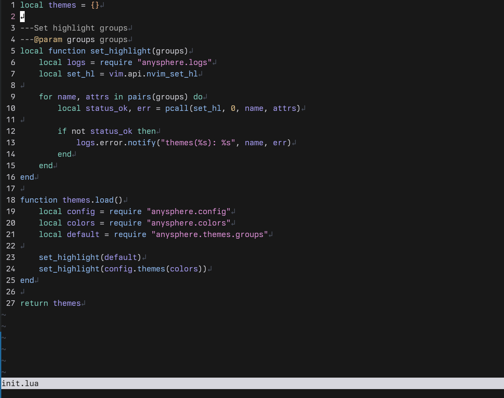

# anysphere.nvim

Anysphere colorscheme for neovim from Cursor AI editor.


    
## Installation
    
```lua
use { "dapovich/anysphere.nvim" }
```
    
## Requirement

- Neovim >= 0.9.1
- [nvim-treesitter](https://github.com/nvim-treesitter/nvim-treesitter) for better syntax highlighting (optional)

## :gear: Setup

```lua
vim.cmd.colorscheme "anysphere"
```

Or prefer below if you want to customize some options

```lua
require("anysphere").setup({
    -- your options
})
```

### Default

```lua
require("anysphere").setup({
    transparent = false,
    colors = {},
    themes = function(colors)
        return {}
    end,
    italics = true,
})
```

#### Example

```lua
require("anysphere").setup({
    transparent = true,  -- enable transparent window
    colors = {
        white = "#ffffff", -- add new color
        pink = "#ec6075", -- replace default color
    },
    themes = function(colors)
        -- change highlight of some groups,
        -- the key and value will be passed respectively to "nvim_set_hl"
        return {
            Normal = { bg = colors.lmao },
            DiffChange = { fg = colors.white:darken(0.3) },
            ErrorMsg = { fg = colors.pink, standout = true },
            ["@lsp.type.keyword"] = { link = "@keyword" }
        }
    end,
    italics = false, -- disable italics
})
```
